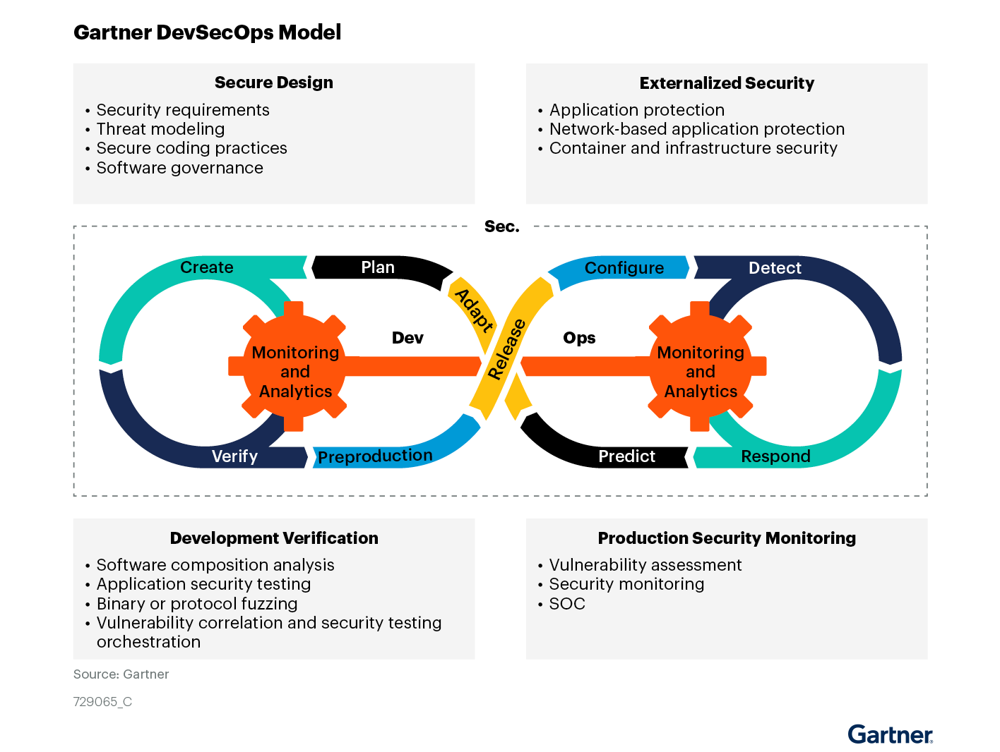

#  DevSecOps Vault

A curated, modular knowledge base for building and scaling secure DevOps (a.k.a. DevSecOps) pipelines.  
This repository brings together tools, best practices, checklists, and resources to help you **"shift security left"** — making it a core part of your SDLC.

---

##  Table of Contents

###  Foundations
- [What is DevSecOps](./content/what-is-devsecops.md)
- [DevSecOps Security Checklist](./content/checklist.md)

### ️ Tools by Category
- [Pre-Commit Tools](./content/tools/precommit.md)
- [Secrets Management](./content/tools/secrets-management.md)
- [SAST Tools](./content/tools/sast.md)
- [DAST Tools](./content/tools/dast.md)
- [Dependency & SBOM Management](./content/tools/dependency-management.md)
- [Supply Chain Security](./content/tools/supply-chain.md)
- [CI/CD Security](./content/tools/ci-cd.md)
- [Containers & Image Scanning](./content/tools/containers.md)
- [Kubernetes Security](./content/tools/kubernetes.md)
- [Multi-Cloud & Cloud Provider Security](./content/tools/cloud.md)
- [Infrastructure as Code Security](./content/tools/iac.md)
- [Policy as Code](./content/tools/policy-as-code.md)
- [Chaos Engineering](./content/tools/chaos.md)
- [Monitoring (WIP)](./content/tools/monitoring.md)

###  Learning & References
- [Books & Publications](./content/resources/books.md)
- [Conferences](./content/resources/conferences.md)
- [Training Labs](./content/resources/labs.md)
- [Vulnerable Targets](./content/resources/vulnerable-apps.md)

---

##  Philosophy

DevSecOps isn't a tool — it's a **mindset and cultural shift**. It empowers teams to take ownership of security from the first line of code to deployment, monitoring, and beyond.

By breaking this repository into modular files under the `content/` directory, we aim to make the resource:
- **Scalable** as the ecosystem grows
- **Maintainable** by contributors
- **Navigable** for learners and professionals alike

---

##  Contributing

Want to add a tool, update a broken link, or fix a typo?

Just submit an issue or a pull request — all contributions are welcome!

---

##  License

[MIT License](./LICENSE)
# What is DevSecOps

DevSecOps is an approach to software development that integrates security into the entire software development lifecycle (SDLC). It combines the principles of DevOps with security to create a culture where security is everyone's responsibility — from developers to operations teams.

---

##  Why DevSecOps?

- **Security from the Start**: Security is built into the pipeline from the first line of code, not tacked on at the end.
- **Collaboration**: Developers, security professionals, and operations teams work together to automate and embed security throughout the SDLC.
- **Automation & Monitoring**: Security checks (e.g., scanning, testing, compliance) are automated and monitored continuously.
- **Faster Delivery**: Security integration accelerates delivery by reducing late-stage security bottlenecks.

---

##  Key Practices in DevSecOps

1. **Secure Design**: Threat modeling and secure architecture from the early stages.
2. **Secure Coding**: Adherence to language-specific secure coding standards.
3. **Security Testing**: Automated SAST, DAST, SCA integrated in CI/CD.
4. **Secrets Management**: Proper handling of API keys, credentials, and sensitive config data.
5. **Monitoring and Response**: Real-time monitoring of applications and infrastructure for threats.
6. **Compliance and Governance**: Automating checks for security policies and regulations.

---

##  Learn More

Here are some great resources to explore DevSecOps further:

- [RedHat – What is DevSecOps](https://www.redhat.com/en/topics/devops/what-is-devsecops)
- [IBM – DevSecOps Explained](https://www.ibm.com/cloud/learn/devsecops)
- [Snyk – DevSecOps Series](https://snyk.io/series/devsecops/)
- [Synopsys – DevSecOps Overview](https://www.synopsys.com/glossary/what-is-devsecops.html)
- [Spacelift – Blog on DevSecOps](https://spacelift.io/blog/what-is-devsecops)

#  DevSecOps Security Checklist

This checklist outlines key practices across the software development lifecycle to embed security into DevOps processes.

---

 [Here is a link for example checklist by Sqreen](./devsecops-security-checklist.pdf)

**The example checklist below provides more solid steps and resources, allowing adjustments to tailor a DevSecOps checklist specific to your project's needs and yours.**

---

## 1.  Design

###  Secure Development Lifecycles

- [Microsoft SDL (Secure Development Lifecycle)](https://www.microsoft.com/en-us/securityengineering/sdl/practices)
- [OWASP SAMM (Software Assurance Maturity Model)](https://github.com/OWASP/samm)
- [BSIMM (Building Security In Maturity Model)](https://www.bsimm.com/framework.html)
- [NIST SSDF (Secure Software Development Framework)](https://csrc.nist.gov/CSRC/media/Publications/white-paper/2019/06/07/mitigating-risk-of-software-vulnerabilities-with-ssdf/draft/documents/ssdf-for-mitigating-risk-of-software-vulns-draft.pdf)
- [GitLab - 9 Tips for Shifting Left](https://about.gitlab.com/blog/2020/06/23/efficient-devsecops-nine-tips-shift-left/)
- [GitLab - Speed and Security](https://about.gitlab.com/blog/2019/10/31/speed-security-devops/)

### ️ Threat Modeling

- [Wikipedia: Threat Modeling](https://en.wikipedia.org/wiki/Threat_model)
- [OWASP: Threat Modeling](https://owasp.org/www-community/Threat_Modeling)
- [OWASP: Application Threat Modeling](https://owasp.org/www-community/Application_Threat_Modeling)
- [Threagile - Agile Threat Modeling Toolkit](https://threagile.io)
- [OWASP Threat Dragon](https://threatdragon.github.io)

---

## 2. ‍ Develop

###  Secure Coding Standards

- [Apple Secure Coding Guide](https://developer.apple.com/library/archive/documentation/Security/Conceptual/SecureCodingGuide/Introduction.html)
- [Secure Coding Guidelines for Java SE (Oracle)](https://www.oracle.com/java/technologies/javase/seccodeguide.html)
- [Go-SCP: Secure Coding in Go (OWASP)](https://github.com/OWASP/Go-SCP)
- [Android App Security Best Practices (Google)](https://developer.android.com/topic/security/best-practices)
- [Securing Rails Applications](https://guides.rubyonrails.org/security.html)

---

## 3. ️ Build

###  SAST (Static Application Security Testing)

- [SAST with SonarQube – Part 1](https://medium.com/nycdev/scan-your-source-code-for-vulnerabilities-using-static-application-security-testing-sast-with-5f8ee1fdf9aa)
- [GitHub Blog: Code Scanning Tools](https://github.blog/2020-10-05-announcing-third-party-code-scanning-tools-static-analysis-and-developer-security-training/)

---

## 4.  Test

###  DAST (Dynamic Application Security Testing)

- [ZAP + GitHub Actions](https://www.zaproxy.org/blog/2020-05-15-dynamic-application-security-testing-with-zap-and-github-actions/)
- [GitLab DAST Docs](https://docs.gitlab.com/ee/user/application_security/dast/)
- [Nuclei GitHub Action](https://github.com/secopslab/nuclei-action)
- [ZAPCon 2021 – Democratizing ZAP](https://youtu.be/jimW-R6_F4U)

### ️‍️ Penetration Testing

- [Penetration Testing at DevSecOps Speed](https://securityboulevard.com/2019/04/penetration-testing-at-devsecops-speed/)

---

## 5.  Deploy

### ️ Hardening & Configuration

- [CIS Benchmarks](https://www.cisecurity.org/cis-benchmarks/)
- [DevSecOps in Kubernetes (Microsoft)](https://cloudblogs.microsoft.com/opensource/2019/07/22/devsecops-in-kubernetes/)

###  Image Scanning

- [Best Practices for Scanning Docker Images](https://docs.docker.com/develop/scan-images/)

---

## 6.  Operate and Monitor

### ️ Runtime Protection

- [RASP by Rapid7](https://www.rapid7.com/fundamentals/runtime-application-self-protection/)
- [DevSecOps with IAST and RASP (OWASP EU 2018)](https://2018.appsec.eu/presos/DevOps_Jumpstarting-Your-DevSecOps_Jeff-Williams_AppSecEU2018.pdf)

###  Patch and Audit

- Integrate RASP and IAST tools for runtime protection and feedback.
- Conduct regular security audits and reviews.

###  Monitoring & Metrics

- Use SIEMs and runtime metrics to monitor app health and anomalies.
- [OWASP Attack Surface Analysis Cheat Sheet](https://cheatsheetseries.owasp.org/cheatsheets/Attack_Surface_Analysis_Cheat_Sheet.html)
# Tools
#  Pre-Commit Security Tools

DevSecOps pre-commit tools are a critical part of the software development lifecycle, particularly for organizations that prioritize security in their development processes. These tools help ensure that security considerations are integrated into every step of the development process, from coding to deployment.

Here are some reasons why DevSecOps pre-commit tools are important:

- **Early detection of security vulnerabilities:** Pre-commit tools can identify security issues early in the development process, before code is even committed to the repository. This allows developers to address security concerns immediately, rather than discovering them later in the development process when they can be much more difficult and expensive to fix.

- **Consistent security standards:** Pre-commit tools can enforce consistent security standards across the development team, ensuring that security best practices are followed by all developers.

- **Reduced risk of security breaches:** By catching security issues early, pre-commit tools can help reduce the risk of security breaches and protect sensitive data.

- **Improved efficiency:** Pre-commit tools can help developers catch security issues before they become more complex and time-consuming to fix, which can ultimately lead to more efficient development processes.

- **Enhanced collaboration:** Pre-commit tools can help facilitate collaboration between developers and security teams by providing a common language and set of standards for discussing security issues.

Overall, DevSecOps pre-commit tools play a critical role in ensuring that security is integrated into the software development lifecycle. By catching security issues early and enforcing consistent standards, these tools help organizations build more secure and efficient software.

##  Tools for Pre-commit Stage

| Name | URL | Description | Stars |
| :--- | :-- | :---------- | :---: |
| **git-secrets** | [GitHub](https://github.com/awslabs/git-secrets) | Prevents committing secrets to git |  |
| **git-hound** | [GitHub](https://github.com/tillson/git-hound) | Searches for secrets in git history |  |
| **goSDL** | [GitHub](https://github.com/slackhq/goSDL) | Secure Development Lifecycle checklist by Slack |  |
| **ThreatPlaybook** | [GitHub](https://github.com/we45/ThreatPlaybook) | Threat modeling as code |  |
| **Threat Dragon** | [GitHub](https://github.com/OWASP/threat-dragon) | OWASP threat modeling tool |  |
| **threatspec** | [GitHub](https://github.com/threatspec/threatspec) | Declarative threat modeling for DevSecOps |  |
| **pytm** | [GitHub](https://github.com/izar/pytm) | Python framework for threat modeling |  |
| **Threagile** | [GitHub](https://github.com/Threagile/threagile) | Agile threat modeling engine (Go) |  |
| **MAL-lang** | [Website](https://mal-lang.org/#what) | Language to model cyber threats |  |
| **Microsoft TMT** | [Docs](https://docs.microsoft.com/en-us/azure/security/develop/threat-modeling-tool) | Threat modeling tool by Microsoft |  |
| **Talisman** | [GitHub](https://github.com/thoughtworks/talisman) | Prevents secrets from being committed |  |
| **SEDATED (OWASP)** | [GitHub](https://github.com/OWASP/SEDATED) | Sensitive data detection tool |  |
| **Sonarlint** | [GitHub](https://github.com/SonarSource/sonarlint-core) | IDE plugin for secure code linting |  |
| **DevSkim** | [GitHub](https://github.com/microsoft/DevSkim) | IDE security analysis engine |  |
| **detect-secrets** | [GitHub](https://github.com/Yelp/detect-secrets) | Secret detection by Yelp |  |
| **tflint** | [GitHub](https://github.com/terraform-linters/tflint) | Terraform linter with plugins |  |
#  Secrets Management in DevSecOps

Secrets management is a foundational discipline within DevSecOps, focusing on the secure handling of sensitive data such as passwords, API keys, encryption keys, tokens, and certificates. These secrets are critical for communication between services, infrastructure authentication, and secure application behavior — especially within modern CI/CD pipelines and cloud-native environments.

In DevSecOps, where automation and collaboration are paramount, the ability to **manage secrets securely, consistently, and at scale** becomes essential. Poor secrets management can lead to devastating security breaches, leaked credentials, unauthorized access, and non-compliance with industry regulations.

---

##  Why Secrets Management is Crucial

Modern software systems rely heavily on automated deployments, microservices, and distributed infrastructure. This creates numerous entry points and access needs across components, tools, and teams. Secrets — such as database credentials, cloud provider access keys, or signing certificates — are used extensively across:

- Development environments
- Testing infrastructure
- Build pipelines
- Cloud orchestration layers
- Production systems

Without secure handling, secrets are often:
- Hardcoded into codebases or scripts
- Accidentally committed to version control
- Stored in plaintext in environment files or config maps
- Rotated rarely, if ever

By implementing proper secrets management, DevSecOps teams can protect against these risks and ensure secrets are encrypted, rotated regularly, audited, and only accessible by authorized entities.

---

##  Tools for Secrets Detection and Management

| Name | URL | Description | Stars |
|------|-----|-------------|:-----:|
| **Gitleaks** | [GitHub](https://github.com/zricethezav/gitleaks) | A fast and reliable tool for detecting hardcoded secrets like passwords, API keys, and tokens in Git repositories and commit history. |  |
| **ggshield** | [GitHub](https://github.com/gitguardian/ggshield) | CLI tool by GitGuardian that scans commits, branches, and repositories for 350+ types of secrets. Designed to run locally or within CI/CD. |  |
| **TruffleHog** | [GitHub](https://github.com/trufflesecurity/truffleHog) | Scans Git history, file systems, and live repos for secrets and high-entropy strings. Offers heuristics and entropy analysis for better detection. |  |
| **HashiCorp Vault** | [GitHub](https://github.com/hashicorp/vault) | An industry-standard tool for secure storage, access control, secret leasing, and encryption-as-a-service. Supports dynamic secrets, audit logging, and tight access policies. |  |
| **Mozilla SOPS** | [GitHub](https://github.com/mozilla/sops) | A GitOps-friendly secrets management tool that encrypts individual values inside YAML, JSON, ENV, and INI files using KMS, PGP, or GCP/Azure keys. |  |
| **AWS Secrets Manager GitHub Action** | [Marketplace](https://github.com/marketplace/actions/aws-secrets-manager-actions) | Enables automated retrieval of secrets from AWS Secrets Manager in GitHub Actions workflows. Great for securely passing secrets to CI jobs. |  |
| **GitRob** | [GitHub](https://github.com/michenriksen/gitrob) | Analyzes public repositories and organization-wide commits to detect accidentally exposed secrets or sensitive files. |  |
| **git-wild-hunt** | [GitHub](https://github.com/d1vious/git-wild-hunt) | Hunts for secrets in GitHub repositories using GitHub’s search API. Designed to help organizations discover leaked tokens or credentials. |  |
| **aws-vault** | [GitHub](https://github.com/99designs/aws-vault) | Securely stores AWS credentials and lets you assume roles via the command line, using OS keychain-based credential storage. |  |
| **Knox** | [GitHub](https://github.com/pinterest/knox) | Pinterest’s internal service for centralized management, secure rotation, and delivery of secrets and encryption keys. |  |
| **Chef Vault** | [GitHub](https://github.com/chef/chef-vault) | Tool for securely encrypting and sharing data bags across Chef infrastructure. Integrates with Chef’s access control features. |  |
| **Ansible Vault** | [Docs](https://docs.ansible.com/ansible/latest/cli/ansible-vault.html) | Encrypts variable files, YAML config, and secrets used within Ansible playbooks. Simple to use for secret sharing and version control. |  |

---

## ️ Best Practices for Secrets Management

- **Never hardcode secrets** in source code or CI/CD configs.
- **Use environment variables** injected securely at runtime via orchestrators or vault tools.
- **Rotate secrets regularly**, especially after personnel changes or detected leaks.
- **Audit access and usage logs** of secret retrieval systems.
- **Use Git hooks or CI guards** to detect secrets before pushing.
- **Adopt GitOps-friendly tools** (e.g., SOPS, Sealed Secrets) when managing secrets in Git.
- **Store secrets externally**, not in Dockerfiles, Kubernetes manifests, or `.env` files unless encrypted.

#  Static Application Security Testing (SAST)

Static Application Security Testing (SAST) is a fundamental part of DevSecOps pipelines, enabling early detection of vulnerabilities by analyzing the source code, bytecode, or binaries **without executing the program**. Unlike DAST (Dynamic Application Security Testing), which simulates real-world attacks on running applications, SAST tools scan code to identify security flaws such as:

- Input validation issues
- Insecure function usage
- Hardcoded secrets
- Insecure configurations
- Potential injection points (SQL, XSS, etc.)

SAST tools are ideal for **"shift-left"** security — identifying vulnerabilities before the code is even compiled, and integrating these checks into IDEs or CI pipelines ensures fast feedback loops and secure-by-design coding practices.

---

##  Why SAST Matters in DevSecOps

- **Prevents security debt** by catching issues before code reaches production
- **Automates code reviews** for security anti-patterns and risky behaviors
- **Integrates seamlessly** into developer workflows (e.g., Git hooks, IDEs, CI/CD)
- **Provides education**: highlights insecure patterns and recommends best practices

---

##  SAST Tooling Landscape

| Name | URL | Description | Stars |
|------|-----|-------------|:-----:|
| **Semgrep** | [Website](https://semgrep.dev/) / [GitHub](https://github.com/returntocorp/semgrep) | Lightweight, open-source static analyzer supporting 17+ languages. Custom rules can be written with ease. Free and commercial rulepacks available. |  |
| **Bandit** | [GitHub](https://github.com/PyCQA/bandit) | Python-specific static analyzer that checks for common security issues (e.g., `eval`, subprocess usage). |  |
| **gosec** | [GitHub](https://github.com/securego/gosec) | Scans Go source code using AST to identify common coding mistakes that lead to vulnerabilities. |  |
| **Brakeman** | [GitHub](https://github.com/presidentbeef/brakeman) | Security scanner specifically for Ruby on Rails applications. Fast, powerful, and framework-aware. |  |
| **SonarQube (Community)** | [GitHub](https://github.com/SonarSource/sonarqube) | Widely adopted tool for static analysis and code quality with built-in security rulesets for multiple languages. |  |
| **FindSecurityBugs** | [Website](https://find-sec-bugs.github.io/) | A SpotBugs plugin for identifying security vulnerabilities in Java codebases. |  |
| **libsast** | [GitHub](https://github.com/ajinabraham/libsast) | SAST toolkit for security engineers; uses regex + semantic scanning via Semgrep. Language-agnostic. |  |
| **nodejsscan** | [GitHub](https://github.com/ajinabraham/nodejsscan) | Node.js and JavaScript static analyzer with a web UI. Targets OWASP Top 10 issues. |  |
| **Safety** | [GitHub](https://github.com/pyupio/safety) | Checks Python dependencies (from `requirements.txt`) for known vulnerabilities using a vulnerability DB. |  |
| **ESLint** | [Website](https://eslint.org/) | Widely used JavaScript/TypeScript linter. Security rules can be added via plugins like `eslint-plugin-security`. | – |

---

## ️ Best Practices for Using SAST in DevSecOps

1. **Integrate into CI/CD Pipelines**  
   Run SAST tools automatically on pull requests and merges. Tools like `Semgrep`, `Bandit`, and `gosec` can be run as GitHub Actions, GitLab CI jobs, or Jenkins stages.

2. **Use Language-Specific Tools**  
   Choose tools optimized for the tech stack you're using. e.g., `Bandit` for Python, `Brakeman` for Rails, `gosec` for Go, `nodejsscan` for JavaScript.

3. **Create Custom Rules**  
   Tools like `Semgrep` or `libsast` allow writing organization-specific rules to detect insecure patterns unique to your codebase or threat model.

4. **Scan Early, Often, and Automatically**  
   Embed SAST in your developers' IDE (e.g., via `SonarLint`, `Semgrep LSP`, or `eslint`) to provide real-time feedback while coding.

5. **Review and Prioritize Results**  
   Not all findings are equal. Establish severity thresholds (e.g., block builds only on high/critical issues) and use suppressions where necessary.

6. **Train Developers with Contextual Feedback**  
   Use SAST reports to teach secure coding practices. Many tools offer links to CWE/OWASP references and remediation steps.

---

## ️ Licensing Note for Semgrep Users

While the **Semgrep CLI and core ruleset** are open source and free to use, some advanced or commercial rules require a license. You can browse available rules and their licenses here: [https://semgrep.dev/r](https://semgrep.dev/r)

---

##  Further Reading

- [OWASP Source Code Analysis Tools](https://owasp.org/www-community/Source_Code_Analysis_Tools)
- [Scan Source Code using SonarQube (Medium Guide)](https://medium.com/nycdev/scan-your-source-code-for-vulnerabilities-using-static-application-security-testing-sast-with-5f8ee1fdf9aa)
- [GitHub Code Scanning Blog Post](https://github.blog/2020-10-05-announcing-third-party-code-scanning-tools-static-analysis-and-developer-security-training/)
#  Dynamic Application Security Testing (DAST)

Dynamic Application Security Testing (DAST) is a black-box testing technique that analyzes running applications by simulating real-world attacks. Unlike SAST, which inspects source code without execution, DAST interacts with live instances of the application (typically through HTTP) to discover vulnerabilities like:

- Cross-Site Scripting (XSS)
- SQL Injection (SQLi)
- Command injection
- Security misconfigurations
- Broken authentication
- Sensitive data exposure

DAST tools are ideal for identifying vulnerabilities that arise from configuration issues, runtime behavior, or security flaws that only become apparent during execution.

---

##  Why DAST is Critical

- **Covers runtime vulnerabilities** that static tools may miss
- **Simulates real attacker behavior** in QA/staging/production environments
- **Works language-agnostically** — applicable to any web application regardless of the stack
- **Detects misconfigurations** such as open directories, missing headers, or dangerous endpoints
- **Complements SAST/SCA** for full-stack security coverage

---

##  Common DAST Tools

| Name | URL | Description | Stars |
|------|-----|-------------|:-----:|
| **OWASP ZAP** | [Project](https://owasp.org/www-project-zap/) / [GitHub](https://github.com/zaproxy/zaproxy) | OWASP’s flagship DAST tool. Open-source, powerful, and CI/CD friendly (Docker support). GUI + API + automation. |  |
| **Wapiti** | [GitHub](https://github.com/wapiti-scanner/wapiti) | Lightweight CLI web vulnerability scanner. Ideal for scripting and automation in pipelines. |  |
| **Nuclei** | [GitHub](https://github.com/projectdiscovery/nuclei) | High-performance, template-driven scanner for HTTP-based vulnerabilities. Great for custom rules and mass scanning. |  |
| **purpleteam** | [GitHub](https://github.com/purpleteam-labs/purpleteam) | Self-hosted DAST automation tool designed to integrate into pipelines and test APIs, web apps, and endpoints. |  |
| **OSS-Fuzz** | [GitHub](https://github.com/google/oss-fuzz) | Continuous fuzzing platform by Google to find memory and logic bugs in C/C++/Rust apps. Ideal for libraries and backend services. |  |
| **Nikto** | [GitHub](https://github.com/sullo/nikto) | Web server vulnerability scanner that detects outdated components, dangerous files, and security headers. |  |
| **Skipfish** | [Archived](https://code.google.com/archive/p/skipfish/) | Fast web app security recon tool from Google. Useful for brute-force fuzzing and link crawling. |  |

---

## ️ Best Practices for DAST in DevSecOps

1. **Run in staging or test environments**  
   Since DAST tools actively probe endpoints, it’s best to scan non-production instances unless the tool is explicitly configured to be safe.

2. **Automate in CI/CD pipelines**  
   Tools like **OWASP ZAP**, **Wapiti**, or **Nuclei** offer Docker support and CLI modes, making them ideal for GitHub Actions, GitLab CI, or Jenkins pipelines.

3. **Combine template-driven and active scanning**  
   Use `Nuclei` for rule-based scans and `ZAP` for full interaction-based analysis — this covers both depth and breadth.

4. **Tune scanners**  
   Disable intrusive or long-running tests for lightweight builds; run full scans nightly or in dedicated security testing stages.

5. **Integrate with bug trackers**  
   Automatically push findings to issue trackers (e.g., Jira, GitHub Issues) with tools like ZAP’s API or custom scripts.

6. **Baseline and suppress false positives**  
   DAST tools often produce noise — invest time in tuning your rules and maintaining suppression lists for known-safe behavior.

---

##  Further Reading

- [ZAP + GitHub Actions Tutorial](https://www.zaproxy.org/blog/2020-05-15-dynamic-application-security-testing-with-zap-and-github-actions/)
- [GitLab DAST Integration](https://docs.gitlab.com/ee/user/application_security/dast/)
- [Using Nuclei in CI (GitHub Action)](https://github.com/secopslab/nuclei-action)
- [ZAPCon 2021 - Test Automation & DSLs for DAST](https://youtu.be/jimW-R6_F4U)
- [Penetration Testing at DevSecOps Speed](https://securityboulevard.com/2019/04/penetration-testing-at-devsecops-speed/)
#  Dependency and SBOM Management

Modern applications rely heavily on third-party libraries, frameworks, and open-source components. While these speed up development, they also introduce risks from outdated, vulnerable, or even malicious packages — often referred to as **supply chain risks**.

Open Source Software (OSS) and Dependency Management are two critical areas that intersect with Dependency Security Testing and Analysis in discovering supply chain attacks. Dependency management is the practice of managing and tracking the libraries, frameworks, and other components that are used to build software applications. Open Source Software (OSS) refers to software that is developed and distributed under a license that allows developers to freely modify and distribute the source code.

Dependency management in DevSecOps includes:
- Tracking dependencies (direct and transitive)
- Scanning for known vulnerabilities (CVE databases, advisories)
- Creating and maintaining **Software Bill of Materials (SBOMs)**
- Detecting tampering or dependency confusion attacks
- Ensuring compliance with open-source licenses

---

##  Why It's Important

- **Visibility**: Know exactly what your application is built with — including all third-party code.
- **Security**: Identify vulnerable components before they are exploited.
- **Compliance**: Demonstrate awareness of licensing and security standards (e.g., NIST 800-218 / SSDF).
- **Traceability**: SBOMs help in incident response, legal inquiries, and operational auditing.

---

##  Dependency Management & SBOM Tools

| Name | URL | Description | Stars |
|------|-----|-------------|:-----:|
| **CycloneDX** | [GitHub](https://github.com/orgs/CycloneDX/repositories) | A lightweight SBOM format supported by many tools. Ideal for generating and sharing software component inventories. |  |
| **cdxgen** | [GitHub](https://github.com/AppThreat/cdxgen) | SBOM generator supporting multiple languages and build systems. Outputs CycloneDX format. |  |
| **SPDX** | [GitHub](https://github.com/spdx/spdx-spec) | The SPDX format (by the Linux Foundation) defines a standardized way to describe software components, licenses, and security metadata. |  |
| **Snyk** | [GitHub](https://github.com/snyk/snyk) | Developer-first SCA and container vulnerability scanner. CLI and IDE integration available. |  |
| **vulncost** | [GitHub](https://github.com/snyk/vulncost) | Snyk-powered VS Code extension to show security issues inline with your code’s dependencies. |  |
| **Dependency Combobulator** | [GitHub](https://github.com/apiiro/combobulator) | Detects dependency confusion and other supply chain attacks using behavioral heuristics. |  |
| **DependencyTrack** | [GitHub](https://github.com/DependencyTrack/dependency-track) | Vulnerability tracking system that ingests SBOMs and continuously monitors project risk. |  |
| **DependencyCheck** | [GitHub](https://github.com/jeremylong/DependencyCheck) | OWASP's Java-based CLI and Jenkins plugin for detecting known vulnerabilities in software dependencies. |  |
| **Retire.js** | [GitHub](https://github.com/retirejs/retire.js) | Scans JavaScript libraries for known vulnerabilities. Supports CLI, browser plugin, and CI integrations. |  |
| **PHP Security Checker** | [GitHub](https://github.com/fabpot/local-php-security-checker) | Checks PHP dependencies using `composer.lock` against vulnerability databases. |  |
| **bundler-audit** | [GitHub](https://github.com/rubysec/bundler-audit) | Scans Ruby’s `Gemfile.lock` against known vulnerabilities from the rubysec advisory DB. |  |
| **Gemnasium Analyzer (GitLab)** | [GitLab](https://gitlab.com/gitlab-org/security-products/analyzers/gemnasium) | Analyzer engine used by GitLab for SCA in CI pipelines. Supports Java, Node, Python, and more. | – |
| **Dependabot** | [GitHub](https://github.com/dependabot/dependabot-core) | GitHub-native tool for dependency updates and alerts. Generates automatic pull requests. |  |
| **Renovatebot** | [GitHub](https://github.com/renovatebot/renovate) | Dependency update bot supporting a wide range of ecosystems. Supports auto-merging and changelog creation. |  |
| **npm-check** | [NPM](https://www.npmjs.com/package/npm-check) | CLI for checking outdated, unused, or incorrect packages in Node.js projects. |  |
| **Security Scorecards** | [Website](https://securityscorecards.dev) | Scorecard of open-source repos using metrics like branch protection, dependency update automation, and security posture. |  |
| **Syft** | [GitHub](https://github.com/anchore/syft) | Generates SBOMs for container images, filesystems, and codebases. Outputs CycloneDX, SPDX, etc. |  |

---

## ️ Best Practices for Dependency & SBOM Security

1. **Always scan third-party libraries** as part of your CI/CD process using SCA tools like `DependencyCheck`, `Snyk`, or `Retire.js`.

2. **Generate SBOMs** during build time using `cdxgen`, `Syft`, or `CycloneDX`. Include them in your release artifacts.

3. **Monitor SBOMs continuously** with tools like `DependencyTrack`, so you are alerted when a new CVE affects one of your components.

4. **Automate updates** using bots like `Dependabot` or `Renovate` and review dependency diffs.

5. **Pin versions** and avoid version drift. Use `package-lock.json`, `poetry.lock`, `Pipfile.lock`, etc.

6. **Track trends over time** — monitor the number of dependencies, vulnerabilities, and resolution time.

7. **Include license checks** in your dependency scans to maintain legal compliance.

---

##  Further Reading

- [CycloneDX Specification](https://cyclonedx.org/specification/overview/)
- [SPDX – The Software Package Data Exchange](https://spdx.dev)
- [OpenSSF Scorecards](https://securityscorecards.dev/)
- [NIST Guidelines on SBOMs](https://www.nist.gov/itl/executive-order-14028-improving-nations-cybersecurity/software-security-supply-chains-software-1)
#  Supply Chain Security in DevSecOps

Software supply chain security focuses on ensuring the **integrity, authenticity, and trustworthiness** of the components, tools, and workflows used to build and deploy software. This includes:

- Source code
- Third-party dependencies
- Build tools and compilers
- CI/CD pipelines and artifacts
- Container images
- Deployment infrastructure

Recent attacks (SolarWinds, CodeCov, dependency confusion) have demonstrated how attackers target the software supply chain rather than just the application itself.

---

##  Why Supply Chain Security Matters

- Modern software is **assembled, not written from scratch** — much of the code is external
- **CI/CD pipelines are privileged environments** and attractive targets for attackers
- **A compromised package or build step can poison downstream consumers**
- Compliance standards like SLSA and NIST SSDF now require attestations and provenance

Supply chain security is not just about protecting your software — it's about protecting your users, customers, and everyone who depends on what you ship.

---

##  Key Concepts

| Concept | Description |
|--------|-------------|
| **SBOM (Software Bill of Materials)** | A detailed list of all components in your software, similar to an ingredients label |
| **Attestation** | Metadata that proves a build was created in a specific environment, from specific inputs |
| **Provenance** | The complete trace of a software artifact’s origin, including who built it, how, and with what tools |
| **Tamper Evidence** | Mechanisms (e.g., signatures, hashes) that reveal if any component has been modified |

---

##  Tools for Supply Chain Security

| Name | URL | Description | Stars |
|------|-----|-------------|:-----:|
| **Tekton Chains** | [GitHub](https://github.com/tektoncd/chains) | Generates cryptographically signed provenance (in-toto/SLSA) from Tekton pipelines |  |
| **in-toto** | [GitHub](https://github.com/in-toto/attestation/tree/v0.1.0/spec) | Framework for creating and verifying provenance metadata during CI/CD execution |  |
| **SLSA (Supply-chain Levels for Software Artifacts)** | [Docs](https://slsa.dev/spec/v1.0/) | A framework for achieving and measuring software build integrity. Backed by OpenSSF and Google. |  |
| **kritis** | [GitHub](https://github.com/grafeas/kritis) | Policy engine for enforcing image signatures and metadata in Kubernetes clusters |  |
| **Ratify** | [GitHub](https://github.com/deislabs/ratify) | Extensible framework for verifying container artifact signatures, attestations, and policies |  |

---

## ️ Best Practices

1. **Generate SBOMs at build time**  
   Use tools like `Syft` or `cdxgen` to produce SBOMs and include them in your build artifacts.

2. **Adopt SLSA framework**  
   Aim for SLSA level 2+ to ensure builds are reproducible, verifiable, and traceable.

3. **Use signed artifacts**  
   Sign container images, binaries, and packages with tools like `Cosign` or Notary.

4. **Validate artifact integrity**  
   Enforce checks at deployment using admission controllers (`Ratify`, `Kritis`).

5. **Treat CI/CD as code**  
   Version control your pipeline configs and scan them just like app code.

6. **Isolate build environments**  
   Avoid sharing build infrastructure across untrusted code. Use ephemeral runners.

7. **Continuously monitor dependencies**  
   Combine SCA + SBOM ingestion (e.g., via `DependencyTrack`) to detect downstream impact from known CVEs.

---

##  Further Reading

- [SLSA Levels (Official Site)](https://slsa.dev/spec/v1.0/)
- [in-toto Project Overview](https://in-toto.io/)
- [OpenSSF Supply Chain Security Whitepaper](https://openssf.org/blog/2023/05/31/openssf-supply-chain-integrity-working-group-provides-security-guidance-practical-frameworks-and-tools/)
- [Mitigating Supply Chain Attacks with Attestation (Tekton Blog)](https://www.ozone.one/supply-chain-security-with-tekton-chains)
# ️ CI/CD Security

In DevSecOps, securing the Continuous Integration and Continuous Deployment (CI/CD) pipeline is crucial. While CI/CD accelerates software delivery, it also introduces new **attack surfaces** such as:

- Insecure environment variables
- Leaked credentials or secrets in workflows
- Misconfigured runner permissions
- Untrusted third-party actions or plugins
- Insecure artifact storage or build caching
- Dependency injection or path traversal in build scripts

An insecure CI/CD setup can result in **complete compromise of your source code, cloud credentials, production systems**, or supply chain integrity.

---

##  Why Securing CI/CD Matters

- CI/CD systems often hold **the keys to the kingdom** (deploy credentials, secrets, access tokens).
- They run with high privileges and can modify or deploy infrastructure and application code.
- Attackers actively target build pipelines (e.g., SolarWinds, CodeCov, CircleCI breaches).
- Ensuring pipeline security is essential to the trustworthiness of software supply chains.

---

##  Tools for CI/CD Hardening and Monitoring

###  GitHub Actions Security

| Name | URL | Description | Stars |
|------|-----|-------------|:-----:|
| **Security Hardening Guide (GitHub)** | [Docs](https://docs.github.com/en/actions/security-guides/security-hardening-for-github-actions) | Official GitHub guide covering isolation, permissions, and secrets handling best practices. | – |
| **GitHub Actions Security Best Practices (Salesforce)** | [Blog](https://engineering.salesforce.com/github-actions-security-best-practices-b8f9df5c75f5) | Practical strategies from Salesforce for securing workflows. | – |
| **GitGuardian GitHub Actions Cheat Sheet** | [Blog](https://blog.gitguardian.com/github-actions-security-cheat-sheet/) | A summarized, visual checklist of secure actions usage, tokens, and more. | – |

###  Jenkins Security

| Name | URL | Description | Stars |
|------|-----|-------------|:-----:|
| **Securing Jenkins (Official)** | [Docs](https://www.jenkins.io/doc/book/security/) | Covers user access control, CSRF protection, agent security, etc. | – |
| **SANS Whitepaper – Securing Jenkins CI Systems** | [PDF](https://www.sans.org/white-papers/36872/) | A thorough breakdown of Jenkins security threats and defense mechanisms. | – |
| **chef-jenkins-hardening** | [GitHub](https://github.com/dev-sec/chef-jenkins-hardening) | (Deprecated) Infrastructure-as-code module to apply security best practices in Jenkins deployments. |  |

---

## ️ Security Considerations for CI/CD Systems

| Aspect | Best Practices |
|--------|----------------|
| **Secrets Management** | Use secret stores (Vault, GitHub/AWS Secrets Manager); never store in plain text or hardcode in workflows |
| **Runner Security** | Prefer isolated runners (ephemeral or containerized); avoid untrusted community-run agents |
| **Permissions** | Use the principle of least privilege for workflow tokens and jobs (`permissions:` block in GitHub Actions) |
| **Third-Party Actions/Plugins** | Pin versions and validate sources; audit dependencies |
| **Build Artifacts** | Store signed artifacts and verify integrity (use tools like Cosign, SLSA provenance) |
| **Logging & Auditing** | Enable build logs, audit trails, and monitor environment variable usage or secrets access |
| **Branch Protections** | Enforce signed commits, status checks, and PR reviews before deployments |
| **Secrets Scanning** | Integrate tools like `detect-secrets`, `gitleaks`, or `ggshield` directly into pipelines |

---

##  Integrating Security into CI/CD Workflows

- **Before Commit**: Use `pre-commit`, `detect-secrets`, `talisman`, `semgrep` locally
- **On Push**: Trigger full SAST/DAST scans, SBOM generation, dependency checks
- **Before Deploy**: Validate secrets, enforce policy-as-code (e.g., OPA), verify image signatures
- **Post Deploy**: Monitor system logs, validate health, send alerts on anomalies

---

##  Further Reading

- [GitHub Actions Hardening Guide (GitHub Docs)](https://docs.github.com/en/actions/security-guides/security-hardening-for-github-actions)
- [GitHub Actions Security Cheat Sheet (GitGuardian)](https://blog.gitguardian.com/github-actions-security-cheat-sheet/)
- [Jenkins Security Best Practices](https://www.jenkins.io/doc/book/security/)
- [SANS Whitepaper – Securing Jenkins CI Systems](https://www.sans.org/white-papers/36872/)
#  Container Security in DevSecOps

Containers, especially Docker-based, are essential to modern DevOps workflows — but they also introduce unique security risks. Misconfigured Dockerfiles, vulnerable base images, overly permissive privileges, or unscanned third-party layers can lead to significant breaches in production environments.

In DevSecOps, container security spans the full lifecycle:

- Secure image creation (shift-left scanning)
- Signature verification and trust (provenance)
- Runtime protection (e.g., syscall monitoring)
- Compliance with hardening benchmarks (e.g., CIS)

---

##  Why Container Security Is Critical

- Containers often **bundle dependencies** and OS libraries — increasing attack surface
- **Vulnerabilities in base images** affect all downstream builds
- **Images can be tampered with** if pulled from public or unsecured registries
- **Default Docker configurations** (e.g., `--privileged`, open ports) are often insecure
- Runtime security issues like **container escape** or **lateral movement** must be mitigated

---

##  Container Security Tools

| Name | URL | Description | Stars |
|------|-----|-------------|:-----:|
| **Trivy** | [GitHub](https://github.com/aquasecurity/trivy) | Fast, all-in-one vulnerability and misconfiguration scanner for container images, filesystems, and repos. |  |
| **Grype** | [GitHub](https://github.com/anchore/grype) | Vulnerability scanner for container images and filesystems; supports SBOM output. |  |
| **Docker Bench for Security** | [GitHub](https://github.com/docker/docker-bench-security) | CIS Docker benchmark automation tool — checks for common Docker misconfigurations. |  |
| **Falco** | [GitHub](https://github.com/falcosecurity/falco) | Runtime threat detection engine for containers, powered by eBPF/syscalls. Ideal for intrusion detection. |  |
| **Clair** | [GitHub](https://github.com/quay/clair) | Static vulnerability analyzer for Docker and OCI images; used by Harbor, Quay. |  |
| **Anchore Engine** | [GitHub](https://github.com/anchore/anchore-engine) | Centralized service for scanning, analysis, and policy enforcement on container images. |  |
| **Harbor** | [GitHub](https://github.com/goharbor/harbor) | CNCF container registry with built-in vulnerability scanning (Clair/Trivy), RBAC, and image signing support. |  |
| **Notary** | [GitHub](https://github.com/notaryproject/notary) | Project to enable signing and verification of Docker images. Now part of the [Notary v2](https://notaryproject.dev) spec. |  |
| **Cosign** | [GitHub](https://github.com/sigstore/cosign) | Container signing and verification tool as part of the Sigstore project. Works with OCI registries. |  |
| **watchtower** | [GitHub](https://github.com/containrrr/watchtower) | Automatically updates running containers when new images are pushed to the registry. Useful for patching. |  |

---

## ️ Best Practices for Container Security

1. **Scan base images** early in your pipeline with Trivy or Grype.
2. **Use minimal, hardened base images** like `distroless` or `alpine`.
3. **Sign images** using Cosign or Notary and enforce signature verification in your Kubernetes or CI/CD policy.
4. **Avoid `latest` tags** — always pin exact versions to prevent surprise updates.
5. **Limit privileges** — use rootless containers, avoid `--privileged`, and define seccomp/apparmor profiles.
6. **Monitor at runtime** — tools like Falco help detect behavior anomalies (e.g., unexpected system calls).
7. **Use private registries** (e.g., Harbor) with RBAC, scanning, and image expiration policies.
8. **Automate updates** for patched images using tools like Watchtower or Renovate with tag filtering.

---

##  Further Reading

- [Docker Security Best Practices (Docker Docs)](https://docs.docker.com/engine/security/security/)
- [Falco Rules and Use Cases](https://falco.org/docs/rules/)
- [CIS Docker Benchmark](https://www.cisecurity.org/benchmark/docker)

# ️ Kubernetes Security in DevSecOps

Kubernetes has become the de facto standard for container orchestration — but with great power comes significant complexity. A misconfigured cluster, insecure workload, or overly permissive RBAC role can expose entire environments.

Kubernetes security involves multiple layers:

- Securing workload configurations (YAMLs, Helm charts)
- Enforcing policies at deploy-time (OPA, Kyverno)
- Hardening the cluster (CIS Benchmarks)
- Monitoring runtime behavior and network traffic
- Detecting risky permissions and attack vectors

---

##  Why Kubernetes Security Matters

- Kubernetes is often deployed in **multi-tenant, production-grade** environments
- Poorly secured clusters can be **lateral movement playgrounds**
- **Misconfigured containers or services** (e.g., `hostNetwork`, `privileged`) can grant host access
- Network policies, RBAC, and admission control are often **misunderstood or underused**
- Kubernetes expands the attack surface — APIs, controllers, secrets, etc.

---

##  Kubernetes Security Tools

| Name | URL | Description | Stars |
|------|-----|-------------|:-----:|
| **Kubeaudit** | [GitHub](https://github.com/Shopify/kubeaudit) | Audit clusters for security misconfigurations (privileged containers, capabilities, etc.) |  |
| **Kubescape** | [GitHub](https://github.com/armosec/kubescape) | Scans Kubernetes clusters against NSA-CISA and MITRE ATT&CK® frameworks |  |
| **Kube-bench** | [GitHub](https://github.com/aquasecurity/kube-bench) | Checks your cluster against CIS Kubernetes Benchmark |  |
| **Kube-hunter** | [GitHub](https://github.com/aquasecurity/kube-hunter) | Actively hunts for security issues in clusters (e.g., open APIs, exposed dashboards) |  |
| **Kubesec** | [GitHub](https://github.com/controlplaneio/kubesec) | Static analysis of Kubernetes YAMLs for security risks |  |
| **Kube-score** | [GitHub](https://github.com/zegl/kube-score) | Linter for K8s manifests focusing on best practices and security |  |
| **Krane** | [GitHub](https://github.com/appvia/krane) | Simple static RBAC analysis tool to detect over-privileged subjects |  |
| **Gatekeeper (OPA)** | [GitHub](https://github.com/open-policy-agent/gatekeeper) | Kubernetes-native policy engine using Open Policy Agent (OPA) and admission controllers |  |
| **Kyverno** | [GitHub](https://github.com/kyverno/kyverno) | Kubernetes-native policy engine (alternative to OPA); easier syntax, great for devs |  |
| **Starboard** | [GitHub](https://github.com/aquasecurity/starboard) | Exposes security scanning results (Trivy, kube-bench) as Kubernetes CRDs |  |
| **KubiScan** | [GitHub](https://github.com/cyberark/KubiScan) | Scans Kubernetes RBAC for risky permissions and service accounts |  |
| **Capsule** | [GitHub](https://github.com/clastix/capsule) | Adds multi-tenancy and policy enforcement to Kubernetes clusters |  |
| **Inspektor Gadget** | [GitHub](https://github.com/kinvolk/inspektor-gadget) | eBPF-based tool collection for tracing, profiling, and auditing Kubernetes activity |  |
| **kube-linter** | [GitHub](https://github.com/stackrox/kube-linter) | Static analysis of Kubernetes manifests for security and correctness issues |  |
| **Mizu (API Traffic Viewer)** | [GitHub](https://github.com/up9inc/mizu) | Observes all API communication in your K8s cluster (e.g., to detect secrets or tokens) |  |
| **Helm Snyk Plugin** | [GitHub](https://github.com/snyk-labs/helm-snyk) | Helm plugin that scans chart image dependencies using Snyk |  |
| **Kubernetes BOM** | [GitHub](https://github.com/kubernetes-sigs/bom) | Generates Software Bill of Materials (SBOM) for Kubernetes itself |  |
| **Badrobot** | [GitHub](https://github.com/controlplaneio/badrobot) | Audits Kubernetes Operators for risky access and behavior |  |
| **Istio** | [Website](https://istio.io) | Service mesh with built-in mutual TLS, RBAC, and telemetry. Useful for network-level Kubernetes security. |  |

---

## ️ Best Practices for Kubernetes Security

1. **Scan manifests before applying** using tools like `kube-score`, `kubesec`, `kube-linter`.
2. **Audit RBAC roles** frequently with tools like `KubiScan` or `Krane`.
3. **Apply CIS Benchmarks** with `kube-bench`.
4. **Restrict Pod privileges** (no `privileged`, `hostNetwork`, etc.).
5. **Use admission controllers** with `Gatekeeper` or `Kyverno` to enforce secure policies.
6. **Isolate namespaces and workloads** using `Capsule`, network policies, and strict resource quotas.
7. **Monitor runtime behavior** using `Falco`, `Inspektor Gadget`, or `Mizu`.
8. **Integrate security findings into CRDs** via `Starboard` for native visibility.

---

##  Further Reading

- [NSA/CISA Kubernetes Hardening Guide](https://media.defense.gov/2022/Aug/29/2003066362/-1/-1/0/CTR_KUBERNETES_HARDENING_GUIDANCE_1.2_20220829.PDF)
- [MITRE ATT&CK for Containers](https://attack.mitre.org/matrices/enterprise/containers/)
- [Kubernetes CIS Benchmark](https://www.cisecurity.org/benchmark/kubernetes)
# ️ Cloud Security in DevSecOps

In DevSecOps, securing cloud infrastructure is just as critical as securing application code. With the rise of Infrastructure as Code and automated CI/CD, cloud environments can change rapidly — and security needs to keep up.

Misconfigured services, overly permissive IAM roles, exposed S3 buckets, and untagged resources are among the **most common sources of cloud breaches**. The tools below help identify, remediate, and enforce secure cloud posture across AWS, GCP, and Azure.

---

##  Multi-Cloud Security Tools

| Name | URL | Description | Stars |
|------|-----|-------------|:-----:|
| **Cloudsploit** | [GitHub](https://github.com/aquasecurity/cloudsploit) | Open-source scanner that detects misconfigurations in AWS, GCP, and Azure services |  |
| **ScoutSuite** | [GitHub](https://github.com/nccgroup/ScoutSuite) | Multi-cloud security auditing tool by NCC Group (supports AWS, Azure, GCP) |  |
| **CloudCustodian** | [GitHub](https://github.com/cloud-custodian/cloud-custodian/) | Policy-as-code engine to manage cloud governance rules across providers |  |
| **CloudGraph** | [GitHub](https://github.com/cloudgraphdev/cli) | GraphQL-based security visualization engine for AWS, Azure, GCP, and K8s |  |

---

## AWS Security Tools

| Name | URL | Description | Stars |
|------|-----|-------------|:-----:|
| **Prowler** | [GitHub](https://github.com/toniblyx/prowler) | CLI tool for AWS security auditing, compliance (CIS, GDPR, PCI-DSS) |  |
| **Dragoneye** | [GitHub](https://github.com/indeni/dragoneye) | Detects exposed AWS resources and compliance violations |  |
| **aws-inventory** | [GitHub](https://github.com/nccgroup/aws-inventory) | Discovers and lists all AWS resources across accounts |  |
| **PacBot** | [GitHub](https://github.com/tmobile/pacbot) | Policy-as-code bot by T-Mobile, manages security and compliance in AWS |  |
| **Komiser** | [GitHub](https://github.com/mlabouardy/komiser) | AWS inventory and cost visualization dashboard with security insights |  |
| **Cloudsplaining** | [GitHub](https://github.com/salesforce/cloudsplaining) | IAM policy analysis tool for detecting privilege escalations and misuse |  |
| **ElectricEye** | [GitHub](https://github.com/jonrau1/ElectricEye) | Continuous AWS misconfiguration monitoring using security standards |  |
| **CloudMapper** | [GitHub](https://github.com/duo-labs/cloudmapper) | Visualizes AWS accounts and detects network misconfigurations |  |
| **Cartography** | [GitHub](https://github.com/lyft/cartography) | Graph-based visualization of cloud and infrastructure assets (AWS-focused) |  |
| **policy_sentry** | [GitHub](https://github.com/salesforce/policy_sentry) | Least-privilege IAM policy generator using CRUD actions |  |
| **AirIAM** | [GitHub](https://github.com/bridgecrewio/AirIAM) | Audit and reduce AWS IAM permissions and create Terraform output |  |
| **StreamAlert** | [GitHub](https://github.com/airbnb/streamalert) | Real-time, serverless alerting framework for AWS logs and data streams |  |
| **CloudQuery** | [GitHub](https://github.com/cloudquery/cloudquery) | SQL-like querying and security analysis over AWS infrastructure |  |
| **S3Scanner** | [GitHub](https://github.com/sa7mon/S3Scanner/) | Tool to find open S3 buckets and dump contents |  |
| **Parliament** | [GitHub](https://github.com/duo-labs/parliament) | AWS IAM policy linting library |  |
| **Yor** | [GitHub](https://github.com/bridgecrewio/yor) | Adds tags to IaC (Terraform, CloudFormation) for traceability and ownership |  |
| **aws-firewall-factory** | [GitHub](https://github.com/globaldatanet/aws-firewall-factory) | Automates deployment and management of AWS WAF across accounts |  |

---

##  GCP-Specific Tool

| Name | URL | Description | Stars |
|------|-----|-------------|:-----:|
| **Forseti Security** | [GitHub](https://github.com/forseti-security/forseti-security) | Suite of tools for auditing and securing Google Cloud Platform environments |  |

---

## ️ Best Practices for Cloud Security

1. Continuously scan for **resource misconfigurations** and open attack surfaces
2. Enforce **least privilege IAM policies** with tools like `policy_sentry`, `AirIAM`
3. **Tag all resources** for accountability and visibility (automate with Yor)
4. Monitor **configuration drift** using real-time frameworks (e.g., ElectricEye)
5. Enable **cross-account and multi-region visibility**
6. Integrate **compliance scans** into CI/CD and infrastructure provisioning steps

---

##  Further Reading

- [AWS Security Best Practices](https://docs.aws.amazon.com/wellarchitected/latest/security-pillar/welcome.html)
- [GCP Security Foundations Guide](https://cloud.google.com/architecture/security-foundations)
- [Cloud Custodian Use Cases](https://cloudcustodian.io/docs/)

#  Infrastructure as Code (IaC) Security

Infrastructure as Code (IaC) allows teams to automate cloud infrastructure through declarative configuration files (e.g., Terraform, CloudFormation, Kubernetes YAMLs). While this improves efficiency and reproducibility, it also introduces **risk**:

- Misconfigured storage buckets
- Publicly exposed cloud services
- Overprivileged IAM roles
- Insecure default settings
- Secrets hardcoded into configuration files

**IaC Security tools help shift security left** by scanning code before it’s deployed.

---

##  Why IaC Security Matters

- IaC defines **production infrastructure** — one typo can lead to breaches
- Cloud-native breaches often stem from misconfiguration, not software bugs
- IaC files are version-controlled — scanning them fits naturally into CI/CD
- Automated scanning ensures consistent policy enforcement across environments

---

##  Tools for IaC Security

| Name | URL | Description | Stars |
|------|-----|-------------|:-----:|
| **Checkov** | [GitHub](https://github.com/bridgecrewio/checkov) | Comprehensive IaC static analysis tool (Terraform, CFN, Kubernetes, ARM, CDK) |  |
| **tfsec** | [GitHub](https://github.com/aquasecurity/tfsec) | Fast Terraform security scanner with customizable rules; CDK support |  |
| **Terrascan** | [GitHub](https://github.com/tenable/terrascan) | Policy-as-code tool to scan Terraform, Helm, and Kubernetes against compliance frameworks |  |
| **KICS** | [GitHub](https://github.com/Checkmarx/kics) | Detects security vulnerabilities, compliance issues across many IaC formats |  |
| **cfsec** | [GitHub](https://github.com/aquasecurity/cfsec) | CloudFormation-specific security scanner by the creators of tfsec |  |
| **cfn_nag** | [GitHub](https://github.com/stelligent/cfn_nag) | Looks for insecure patterns in AWS CloudFormation templates |  |
| **tflint** | [GitHub](https://github.com/terraform-linters/tflint) | Terraform linter with plugins for security and style |  |
| **Sysdig IaC Scanner (GitHub Action)** | [GitHub](https://github.com/sysdiglabs/cloud-iac-scanner-action) | GitHub Action that scans IaC repositories and comments on PRs |  |

---

## ️ Best Practices for IaC Security

1. **Integrate IaC scanning into CI/CD** (pre-commit hooks, GitHub Actions, GitLab CI, etc.)
2. **Define organizational policies as code** (e.g., block exposed ports or wildcard IAM roles)
3. **Avoid hardcoding secrets** — use dynamic secret injection or encrypted references (Vault, SOPS)
4. **Use rule suppression intentionally** — track suppressions in version control
5. **Continuously monitor drift** — use tools like Terraform Cloud, `infracost`, or cloud-native config scanners
6. **Scan all IaC types** — including Terraform, Helm charts, Dockerfiles, K8s YAML, and CDK
7. **Standardize baseline templates** to prevent repeated mistakes across teams

---

##  Further Reading

- [IaC Security Maturity Model (Bridgecrew)](https://github.com/joelparkerhenderson/maturity-models/blob/main/examples/infrastructure-as-code/infrastructure-as-code-maturity-model-by-stafford/index.md)
- [OpenSSF Releases Source Code Management Best Practices Guide](https://openssf.org/blog/2023/09/14/openssf-releases-source-code-management-best-practices-guide/)
- [AWS CloudFormation Security Guide](https://docs.aws.amazon.com/AWSCloudFormation/latest/UserGuide/security-iam.html)
- [Building an IaC security and governance program step-by-step](https://thechief.io/c/bridgecrew/building-iac-security-and-governance-program-step-step/)
#  Policy as Code (PaC) in DevSecOps

Policy as Code (PaC) is the practice of defining security, compliance, and infrastructure rules in a programmable format. Rather than relying on manual reviews or documentation, policies are **version-controlled, testable, and enforced automatically**.

PaC allows organizations to enforce:

- Security guardrails (e.g., block open S3 buckets)
- Compliance standards (e.g., CIS, NIST, PCI)
- Operational controls (e.g., resource quotas, naming conventions)

By treating policies like software, DevSecOps teams gain consistency, visibility, and scalability across cloud and infrastructure environments.

---

##  Why Policy as Code?

- **Automated enforcement** reduces human error
- Policies can be tested, reviewed, and versioned like code
- Brings **security and compliance into CI/CD pipelines**
- Enables **continuous governance** in Kubernetes and cloud
- Encourages **self-service infrastructure with guardrails**

---

##  Tools for Policy as Code

| Name | URL | Description | Stars |
|------|-----|-------------|:-----:|
| **Open Policy Agent (OPA)** | [GitHub](https://github.com/open-policy-agent/opa) | General-purpose policy engine using the Rego language; integrates with CI/CD, Kubernetes, APIs |  |
| **Gatekeeper** | [GitHub](https://github.com/open-policy-agent/gatekeeper) | OPA-based admission controller for Kubernetes |  |
| **Kyverno** | [GitHub](https://github.com/kyverno/kyverno) | Kubernetes-native policy engine with a more YAML-native syntax |  |
| **CloudFormation Guard (cf-guard)** | [GitHub](https://github.com/aws-cloudformation/cloudformation-guard) | Validate AWS CloudFormation templates against compliance rules |  |
| **InSpec** | [GitHub](https://github.com/inspec/inspec) | Security and compliance testing framework by Chef (now Progress) |  |
| **cnspec** | [GitHub](https://github.com/mondoohq/cnspec) | Cloud-native security engine to assess infrastructure, APIs, IaC, and SaaS environments |  |

---

## ️ Best Practices

1. **Write policies in code, not documents** — integrate into CI/CD pipelines
2. **Use fail-closed patterns** — block insecure resources unless explicitly whitelisted
3. **Version and test your policies** like application code
4. **Align PaC with compliance frameworks** (e.g., CIS Benchmarks, NIST 800-53)
5. **Tag violations with metadata** for traceability and reporting
6. **Promote policy-as-self-service** — let devs test and validate policies locally
7. **Use different engines where appropriate** (OPA for APIs, Kyverno for K8s, cf-guard for CloudFormation)

---

##  Further Reading

- [OPA Documentation](https://www.openpolicyagent.org/docs/latest/)
- [Kyverno Policy Library](https://kyverno.io/policies/)
- [AWS CloudFormation Guard Examples](https://github.com/aws-cloudformation/cloudformation-guard/tree/main/guard-examples)
- [Policy as Code with InSpec](https://learn.chef.io/modules/inspec-basics)
#  Chaos Engineering in DevSecOps

Chaos Engineering is the discipline of experimenting on systems in production-like environments to build **confidence in their resilience**. The goal is to proactively identify weaknesses before they become incidents.

While traditional security practices focus on **preventing attacks**, Chaos Engineering ensures your systems can **recover from failures and attacks** gracefully — including downtime, latency spikes, DNS misroutes, resource exhaustion, and compromised containers.

---

##  Why Chaos Engineering for DevSecOps?

- Proves the reliability of **redundancy, failover, and detection** mechanisms
- Simulates real-world disruptions — including security incidents (e.g., node isolation, pod compromise)
- Helps security teams evaluate **incident response processes**
- Identifies **hidden dependencies** and brittle configurations
- Strengthens CI/CD pipelines by **integrating chaos as a test phase**

---

##  Chaos Engineering Tools

| Name | URL | Description | Stars |
|------|-----|-------------|:-----:|
| **Chaos Mesh** | [GitHub](https://github.com/chaos-mesh/chaos-mesh) | Kubernetes-native chaos platform supporting pod failures, network anomalies, time skew, and more |  |
| **Litmus Chaos** | [Website](https://litmuschaos.io/) | End-to-end chaos engineering for Kubernetes, supports GitOps, observability, workflows |  |
| **Chaos Monkey** | [GitHub](https://github.com/Netflix/chaosmonkey) | Netflix's tool for randomly terminating instances in production to test auto-healing |  |
| **chaoskube** | [GitHub](https://github.com/linki/chaoskube) | Randomly deletes Kubernetes pods to test recovery behaviors |  |
| **Kube-Invaders** | [GitHub](https://github.com/lucky-sideburn/KubeInvaders) | Gamified chaos testing interface for Kubernetes (Space Invaders style!) |  |
| **kube-monkey** | [GitHub](https://github.com/asobti/kube-monkey) | Scheduled pod termination to test deployment resilience in Kubernetes |  |
| **Chaos Engine (Thales)** | [Website](https://thalesgroup.github.io/chaos-engine/) | Intermittently destroys or degrades cloud-based app resources to test resiliency |  |
| **Gremlin** | [Website](https://www.gremlin.com/) | Enterprise SaaS chaos platform with fault injection, security, and compliance capabilities |  |
| **AWS FIS Samples** | [GitHub](https://github.com/aws-samples/aws-fault-injection-simulator-samples) | Fault Injection Simulator templates for AWS workloads (e.g., EC2, ECS, RDS chaos) |  |
| **CloudNuke** | [GitHub](https://github.com/gruntwork-io/cloud-nuke) | CLI tool to destroy all cloud resources in a test environment — extreme chaos testing |  |

---

## ️ Best Practices for Chaos Engineering

1. **Run chaos in staging first**, but strive for production readiness
2. **Monitor during experiments** — ensure metrics, alerts, and dashboards are informative
3. **Use hypothesis-driven experiments** — define expected outcomes before injecting failure
4. **Limit blast radius** using namespaces, filters, or targeting non-critical workloads
5. **Automate in CI/CD pipelines** — test resilience per commit or release
6. **Chaos ≠ Randomness** — the goal is controlled failure, not unpredictability

---

##  Further Reading

- [Principles of Chaos Engineering](https://principlesofchaos.org/)
- [Litmus Chaos Documentation](https://docs.litmuschaos.io/)
- [Gremlin Free Resources](https://www.gremlin.com/resources/)
#  Monitoring & Observability in DevSecOps

Monitoring plays a critical role in DevSecOps by providing visibility into systems, workloads, and pipelines — allowing teams to **detect anomalies, enforce policies, and respond to incidents in real time**.

While traditional DevOps observability tools focus on performance, DevSecOps expands this to include:

- Runtime anomaly detection (e.g., unexpected syscalls, file access)
- Network traffic analysis
- Log monitoring for security signals
- Alerting on policy violations or suspicious behavior
- Forensics and post-incident analysis

---

##  Why Monitoring Matters in DevSecOps

- Helps detect security issues **after deployment**, when static/dynamic testing may no longer apply
- Enables real-time response to intrusion attempts or configuration drifts
- Supports compliance requirements via logging and alerting
- Provides **forensic data** for incident response and auditing

---

##  Monitoring & Security Observability Tools

| Name | URL | Description | Stars |
|------|-----|-------------|:-----:|
| **Falco** | [GitHub](https://github.com/falcosecurity/falco) | Runtime security monitoring using eBPF; detects unexpected syscalls, file writes, process trees |  |
| **Prometheus** | [GitHub](https://github.com/prometheus/prometheus) | Core observability and metrics system; integrates with security exporters for audit trails, access monitoring |  |
| **Grafana** | [GitHub](https://github.com/grafana/grafana) | Visualization layer for metrics and logs; often used to display audit data, alerts, and pipeline health |  |
| **Loki** | [GitHub](https://github.com/grafana/loki) | Scalable log aggregation system that works with Grafana; ideal for container logs |  |
| **Elasticsearch + Kibana (ELK)** | [Website](https://www.elastic.co/what-is/elk-stack) | Full-text search + visualization stack used for log monitoring and threat hunting |  |
| **Sysdig** | [GitHub](https://github.com/draios/sysdig) | Deep container inspection and monitoring with a focus on forensics and runtime behavior |  |
| **Zabbix** | [GitHub](https://github.com/zabbix/zabbix) | Infrastructure monitoring solution with flexible alerting and audit support |  |
| **Wazuh** | [GitHub](https://github.com/wazuh/wazuh) | Security-focused monitoring platform built on OSSEC for host intrusion detection, file integrity, log analysis |  |

---

##  Common Security Metrics to Monitor

| Category | Examples |
|----------|----------|
| **Authentication** | Failed logins, suspicious IPs, login attempts from new geographies |
| **Authorization** | Privilege escalations, RBAC changes, permission grants |
| **Runtime Behavior** | Shell spawns in containers, binary execution, network connections |
| **Network Flow** | Unexpected east-west traffic, excessive egress, non-whitelisted destinations |
| **CI/CD Pipelines** | Skipped tests, failed security gates, unsigned artifact deployments |
| **Secrets Access** | Access to vault, environment variable changes, AWS token usage |
| **File Integrity** | Changes in binaries, unexpected writes in /etc, log tampering |

---

## ️ Best Practices

1. **Define SLAs for security metrics** just like performance metrics.
2. **Centralize logs** from cloud, Kubernetes, CI, applications — normalize them for correlation.
3. **Alert only on meaningful thresholds** to reduce noise.
4. **Correlate across sources** (e.g., login → container exec → outbound traffic).
5. **Use dashboards for traceability** during post-incident reviews.
6. **Tag events with metadata** (commit ID, container hash, user) for forensic clarity.
7. **Store logs securely and immutably**, especially for compliance environments.

---

##  Further Reading

- [Monitoring Kubernetes Security Best Practices (Sysdig)](https://sysdig.com/blog/kubernetes-security-guide/)
- [Falco Rules Examples](https://falco.org/docs/rules/)
- [ELK Stack for Security Analytics](https://www.elastic.co/siem)
- [Wazuh Use Cases](https://documentation.wazuh.com/current/getting-started/use-cases/index.html)
# Resources
#  DevSecOps Books

DevSecOps is a multidisciplinary field that spans development, operations, and security. The following books cover key areas such as secure software delivery, DevOps transformation, container security, and security automation.

These resources can help you:

- Understand DevSecOps principles and implementations
- Build secure CI/CD pipelines
- Secure containerized and cloud-native applications
- Shift security left in the SDLC
- Foster a collaborative DevSecOps culture

---

##  Foundational Reads

###  Securing DevOps
- **Link**: [securing-devops.com/book](https://securing-devops.com/book)
- **Author**: Julien Vehent
- **Description**: A hands-on guide to integrating security into modern DevOps practices. It covers logging, threat modeling, secrets management, and secure delivery.

###  DevOpsSec: Securing Software through Continuous Delivery
- **Link**: [O'Reilly Free Edition](http://www.oreilly.com/webops-perf/free/devopssec.csp)
- **Authors**: Jim Bird
- **Description**: Discusses how to embed security into fast-moving DevOps environments through automation, collaboration, and shared responsibility.

---

##  Container & Cloud Security

###  Docker Security: Quick Reference
- **Link**: [binarymist.io](https://binarymist.io/publication/docker-security/)
- **Author**: Adrian Mouat
- **Description**: Covers security considerations and hardening techniques specific to Docker and containerized workloads.

---

## ‍ Developer-Centric Security

###  Holistic Info-Sec for Web Developers
- **Link**: [Leanpub](https://leanpub.com/b/holisticinfosecforwebdevelopers)
- **Author**: Michal Špaček
- **Description**: A security guide for developers, covering secure design patterns, common mistakes, and modern best practices.

---

##  DevOps Culture & Transformation

###  The DevOps Handbook (Section VI)
- **Link**: [O’Reilly](https://www.oreilly.com/library/view/the-devops-handbook/9781457191381/)
- **Authors**: Gene Kim, Jez Humble, Patrick Debois, John Willis
- **Description**: Covers the DevOps transformation journey, with a dedicated section on security integration within high-performance organizations.

---

##  Suggested Reading Paths

If you're new to DevSecOps:
- Start with **Securing DevOps** and **DevOpsSec** for practical and cultural grounding.

If you're focused on containers and cloud:
- Read **Docker Security** and **The DevOps Handbook** (Section VI).

If you're a developer looking to write secure code:
- Dive into **Holistic Info-Sec for Web Developers**.

---

#  DevSecOps Labs & Hands-on Platforms

DevSecOps is best learned through practice. These labs and training platforms allow you to build, break, and secure applications and infrastructure in simulated or real environments.

They cover key areas such as:

- Secure coding practices
- Threat modeling
- Vulnerability scanning
- Monitoring & logging
- Container and cloud security
- Infrastructure as Code testing

---

## ‍ General DevSecOps Training

###  DevSecOps Bootcamp
- **Link**: [github.com/devsecops/bootcamp](https://github.com/devsecops/bootcamp)
- A community-driven, hands-on curriculum covering the full DevSecOps lifecycle, from build to monitor.

###  Exercism
- **Link**: [exercism.org](https://exercism.org/)
- Offers coding exercises in 60+ languages. Useful for developers to practice secure coding fundamentals.

###  InfosecLabs
- **Link**: [infoseclabs.net](http://www.infoseclabs.net)
- A lab environment providing practical scenarios in offensive and defensive security.

---

##  Security-Specific Labs

###  Infrastructure Monitoring Workshop
- **Link**: [GitHub - DEFCON24 Infra Monitoring](https://github.com/appsecco/defcon24-infra-monitoring-workshop)
- Learn how to monitor cloud infrastructure from a security perspective using open-source tools.

###  PentesterLab
- **Link**: [pentesterlab.com](https://pentesterlab.com/exercises/)
- Offers guided exercises in web application security, including real-world vulnerabilities and exploit practice.

###  VulnHub
- **Link**: [vulnhub.com](https://www.vulnhub.com/)
- Download and run vulnerable virtual machines to simulate attacks, exploits, and secure configurations.

---

##  Cloud & CI/CD Focused Platforms

### ️ Katacoda (archived)
- **Archived**: Now redirects to O'Reilly, but existing tutorials can be accessed via GitHub forks.
- Interactive browser-based terminals for cloud-native and DevOps tooling (e.g., Docker, Kubernetes, Jenkins).

###  Play with Docker / Kubernetes
- [Play with Docker](https://labs.play-with-docker.com/)
- [Play with K8s](https://labs.play-with-k8s.com/)
- Spin up temporary lab environments to test Docker and Kubernetes security without installing anything locally.

#  Vulnerable Applications for DevSecOps Practice

Vulnerable applications are intentionally insecure systems built for learning. They’re essential for DevSecOps teams to test scanners, perform code analysis, validate threat models, and train developers and security engineers.

These apps simulate common web, cloud, mobile, and serverless vulnerabilities — including the OWASP Top 10.

---

##  Web Applications

| Name | Stack | Link | Description |
|------|-------|------|-------------|
| **OWASP Juice Shop** | NodeJS / Angular | [GitHub](https://github.com/OWASP/juice-shop) | One of the most modern and feature-rich vulnerable web apps. Covers entire OWASP Top 10. |
| **DVWA (Damn Vulnerable Web App)** | PHP / MySQL | [GitHub](https://github.com/digininja/DVWA) | Classic vulnerable app with login flaws, SQLi, XSS, command injection, and more. |
| **Mutillidae** | PHP | [Irongeek](http://www.irongeek.com/i.php?page=mutillidae/mutillidae-deliberately-vulnerable-php-owasp-top-10) | Another OWASP-focused PHP app with broken auth, injection, and session bugs. |
| **WebGoat** | Java | [GitHub](https://github.com/WebGoat/WebGoat) | OWASP learning platform designed to teach secure coding through vulnerabilities. |
| **WebGoat.NET** | .NET | [GitHub](https://github.com/OWASP/WebGoat.NET) | ASP.NET version of WebGoat. Great for Windows developers. |
| **RailsGoat** | Ruby on Rails | [GitHub](https://github.com/OWASP/railsgoat) | Vulnerable Rails app focusing on OWASP risks in modern Ruby web apps. |
| **NodeGoat** | Node.js | [GitHub](https://github.com/owasp/nodegoat) | Teaches security through insecure Node.js-based app — includes source and walkthroughs. |
| **OWASP WebGoatPHP** | PHP | [GitHub](https://github.com/OWASP/OWASPWebGoatPHP) | PHP version of WebGoat, focused on insecure PHP practices. |

---

## ️ Serverless / Cloud

| Name | Stack | Link | Description |
|------|-------|------|-------------|
| **OWASP DVSA (Damn Vulnerable Serverless App)** | AWS Lambda | [GitHub](https://github.com/owasp/dvsa) | Insecure serverless functions to demonstrate attacks like insecure IAM, SSRF, broken auth. |
| **LambHack** | AWS Lambda | [GitHub](https://github.com/wickett/lambhack) | Serverless CTF-style lab to explore the unique risks in AWS Lambda apps. |

---

##  OS & Infrastructure

| Name | Stack | Link | Description |
|------|-------|------|-------------|
| **Metasploitable** | Linux | [Rapid7 Docs](https://docs.rapid7.com/metasploit/metasploitable/) | Insecure virtual machine full of remote service flaws, perfect for internal testing and exploitation. |

---

##  How to Use These Apps

1. **Test SAST, DAST, and SCA tools** (e.g., Semgrep, Nuclei, OWASP ZAP) against these apps
2. Use them as targets in **CI/CD security pipelines** (e.g., GitHub Actions, Jenkins)
3. Perform **manual testing and fuzzing**
4. Practice **threat modeling**, identify flaws, and implement remediations
5. Train developers with hands-on **secure coding walkthroughs**

#  DevSecOps Conferences & Events

Conferences and meetups are excellent for learning the latest in DevSecOps, sharing experiences, and discovering new tools and practices. Whether you're focused on secure CI/CD, Kubernetes, cloud security, or software supply chain integrity — there are tracks and talks for you.

---

##  DevSecOps & AppSec Focused Conferences

| Conference | Link | Description |
|------------|------|-------------|
| **DevSecCon** | [devseccon.com](https://www.devseccon.com/) | One of the earliest conferences fully focused on DevSecOps. Offers global events and workshops. |
| **All Day DevOps** | [alldaydevops.com](https://www.alldaydevops.com/) | Free, online DevOps + security event with 24-hour global livestream. |
| **DevOps Connect / RSA DevSecOps** | [devopsconnect.com](https://www.devopsconnect.com/) | DevSecOps track embedded within RSA Conference and other major events. |
| **OWASP Global AppSec** | [owasp.org/events](https://owasp.org/events/) | OWASP-led conference with strong coverage of secure coding, threat modeling, and security testing. |
| **BSides** | [securitybsides.com](https://www.securitybsides.com/) | Community-driven events held globally — practical talks often include DevSecOps tooling and stories. |
| **DEF CON AppSec Village** | [appsecvillage.dev](https://www.appsecvillage.dev/) | Application Security focus inside DEF CON — includes DevSecOps, CI/CD and cloud security content. |

---

## ️ Cloud & Platform Conferences

| Conference | Link | Description |
|------------|------|-------------|
| **AWS re:Inforce** | [reinforce.awsevents.com](https://reinforce.awsevents.com/) | Amazon’s dedicated security conference with strong DevSecOps and cloud-native security focus. |
| **AWS re:Invent** | [reinvent.awsevents.com](https://reinvent.awsevents.com) | Broader AWS event — includes DevSecOps, IAM, containers, and infrastructure security tracks. |
| **KubeCon + CloudNativeCon** | [cncf.io](https://www.cncf.io/events/kubecon-cloudnativecon-global/) | CNCF’s flagship event with a growing focus on Kubernetes-native security and policy. |
| **HashiConf** | [hashicorp.com](https://www.hashicorp.com/hashiconf) | Covers Terraform, Vault, and Policy as Code — vital for securing infrastructure automation. |
| **GitHub Universe** | [githubuniverse.com](https://githubuniverse.com/) | GitHub’s annual event covering secure coding, scanning, and GitHub Actions. |
| **GitLab Commit** | [about.gitlab.com/events/commit](https://about.gitlab.com/events/commit/) | DevSecOps sessions on pipelines, scanning, secrets, and shift-left practices. |

---

##  DevOps + General Tech Conferences (with DevSecOps Content)

| Conference | Link | Description |
|------------|------|-------------|
| **DevOps Days** | [devopsdays.org](https://www.devopsdays.org/) | Grassroots events around the world — some feature security-focused sessions. |
| **Goto Conference** | [gotocon.com](https://gotocon.com) | Developer conference featuring software delivery, platform engineering, and occasionally DevSecOps. |
| **IP Expo Europe** | [ipexpoeurope.com](http://www.ipexpoeurope.com/) | Broader IT conference with cloud, AI, and cybersecurity tracks (DevSecOps adjacent). |
| **ISACA Ireland Conference** | [ISACA Ireland](https://www.isaca.org/chapters5/Ireland/conference/pages/Agenda.aspx) | Includes governance, risk, and compliance — intersects with DevSecOps controls and frameworks. |

---

##  Why Attend?

- Discover new DevSecOps tools before they’re mainstream
- Learn from case studies, failures, and real-life pipeline transformations
- Network with DevOps engineers, AppSec specialists, and tool creators
- Join live workshops, tool demos, and CTF challenges
- Gain CPE credits for professional certifications
